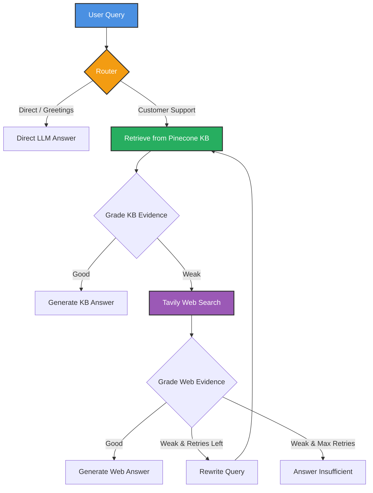

<div align="center">
  
# 🤖 Agentic RAG - Customer Support AI
  
**An advanced, self-correcting Retrieval-Augmented Generation (RAG) system built with intelligent agentic capabilities using LangGraph, LangChain, Groq, Pinecone, and Tavily.**

[](https://python.org)
[](https://langchain.com)
[](https://langchain.com/langgraph)
[](https://pinecone.io)
[](https://groq.com)

</div>

---

## 🌟 Overview

This project implements an **Agentic RAG pipeline** tailored for **Customer Support**. Unlike traditional RAG, this system uses intelligent agents that dynamically decide how to answer a query. 

It evaluates retrieved evidence, falls back to real-time web searches when necessary, and self-corrects by rewriting queries if the initial search fails.

---

## 🏗️ Architecture & Workflow

The agent follows an industry-standard decision graph:



---

## 🧰 Tech Stack

| Component | Technology Used |
| :--- | :--- |
| **Backend API** | FastAPI, Uvicorn |
| **Frontend** | React 19, TypeScript, Vite, Tailwind CSS v4, Lucide |
| **Frameworks** | LangGraph, LangChain |
| **LLM Provider** | Groq (`openai/gpt-oss-20b`) |
| **Vector Database** | Pinecone |
| **Embeddings** | HuggingFace (`all-MiniLM-L6-v2`) |
| **Web Search** | Tavily |
| **Data Source** | HuggingFace Datasets (`Bitext Customer Support`) |

---

## 🚀 Setup Instructions

### 1. Clone the repository
```bash
git clone https://github.com/tilakchow/Agentic-RAG.git
cd Agentic-RAG
```

### 2. Environment Variables
Create a `.env` file in the root directory and add your API keys:
```env
GROQ_API_KEY=your_groq_api_key
PINECONE_API_KEY=your_pinecone_api_key
TAVILY_API_KEY=your_tavily_api_key
```

### 3. Install Python Backend Dependencies
This project uses `uv` for fast dependency management.
```bash
uv sync
```

---

## 💻 Running the Application

### 1. Start the FastAPI Backend
Launch the backend server with uvicorn:
```bash
uv run uvicorn agenticrag.api:app --reload --port 8000
```
- API Docs: `http://localhost:8000/docs`
- Health check: `http://localhost:8000/health`
- Chat endpoint: `POST http://localhost:8000/chat`

### 2. Start the React Frontend
In a separate terminal, launch the Vite development server:
```bash
cd frontend
npm install
npm run dev
```
Open `http://localhost:5173` in your browser to interact with the agent!

---

## 🧪 Terminal Testing
To run a standalone conversation test verifying thread-based memory:
```bash
uv run python test_run.py
```

---

## 👨‍💻 Author

**Tilak chowdary**  
📧 [tilakchowdary18@gmail.com](mailto:tilakchowdary18@gmail.com)
